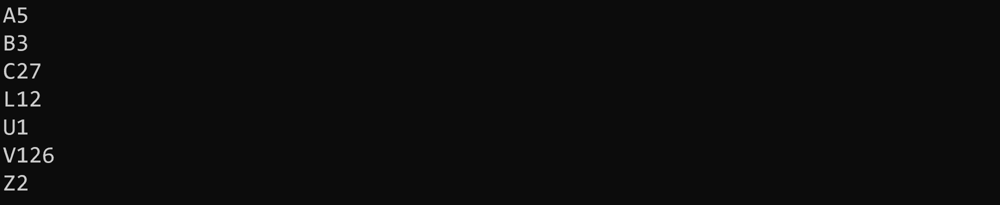
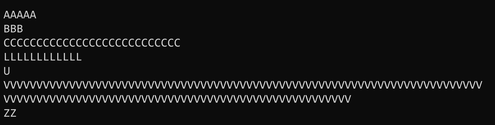
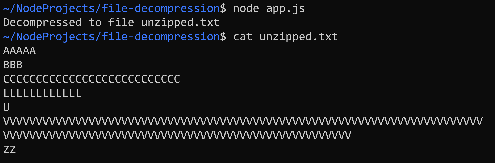

# File Decompression

Der Inhalt der Datei `zipped.txt` liegt in verpackter Form vor: "A5" steht für "AAAAA", "B3" für "BBB" etc.

## Task 1: Read File
Erstellen Sie das Modul `decompress.js`. Lesen Sie darin in der Funktion `decompressFile()` die übergebene Datei `file` ein und geben Sie den (verpackten) Inhalt auf der Konsole aus:

```javascript
function decompressFile(file) {
    ...
    console.log(content);
}
```

Exportieren Sie die Funktion und rufen Sie diese in `app.js` mit dem Argument `'zipped.txt'` auf:



## Task 2: Decompress Data

Implementieren Sie im Modul `decompress.js` die Funktion `decompressLine(line)`:
  - Der Parameter `line` ist eine verpackte Zeile (z. B. `"A5"`).
  - Der Rückgabewert der Funktion ist die entpackte Zeile (z. B. `"AAAAA"`).

Verwenden Sie `decompressLine()` in der Methode `decompressFile()` um den Dateiinhalt zeilenweise zu entpacken und anschließend auf der Konsole auszugeben.



## Task 3: Write File

Implementieren Sie im Modul `decompress.js` die Funktion `writeFile(file, lines)`:
  - Der Parameter `file` ist der Name der Datei, die erstellt werden soll.
  - Der Parameter `lines` ist ein String-Array, dessen Inhalt in die Datei geschrieben werden soll.

Rufen Sie `writeFile()` in `decompressFile()` mit dem Argument `"unzipped.txt"` auf. Führen Sie anschließend das Programm aus und prüfen Sie ob die entpackte Datei erstellt wurde.



## Task 4: Handle Errors

Stellen Sie sicher, dass sowohl beim Lesen als auch beim Schreiben der Dateien im Fehlerfall eine Meldung ausgegeben wird. Ihre App darf keinesfalls abstürzen.

